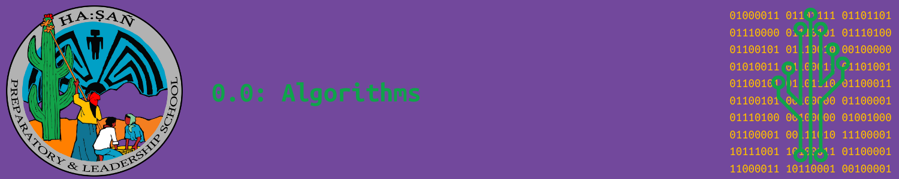

By the end of this section, you will be able to...

# Objectives

> - Define what an algorithm is and explain its importance in computer science.
> - Provide examples of algorithms used in daily life and in computer systems.
