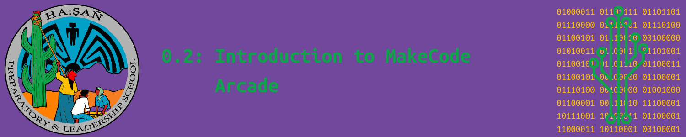

# Objectives

By the end of this section, you will be able to...

> - Navigate the MakeCode Arcade environment.
> - Test and modify a program using the MakeCode Arcade.
> - Flash a MakeCode program in O'odham on a MakeCode device.