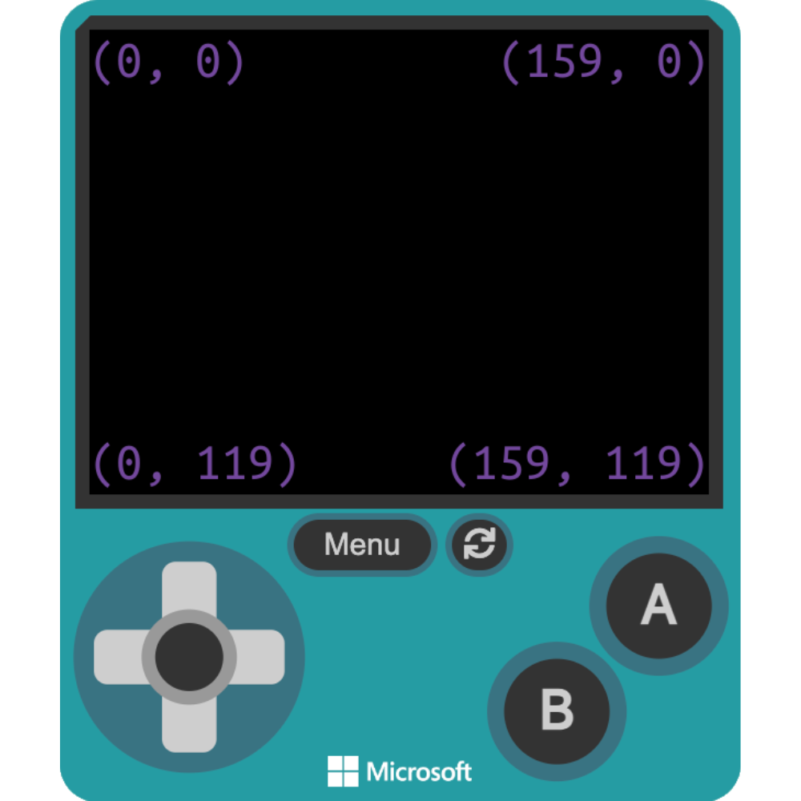
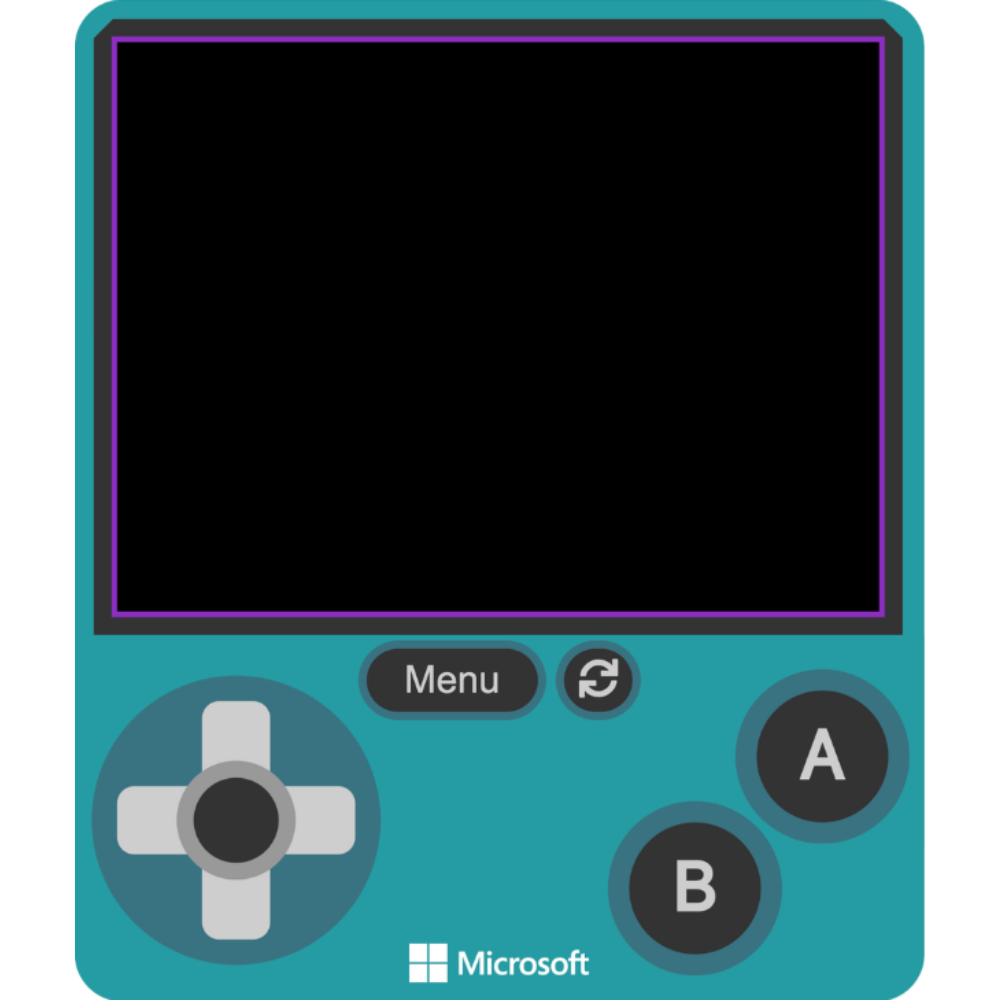
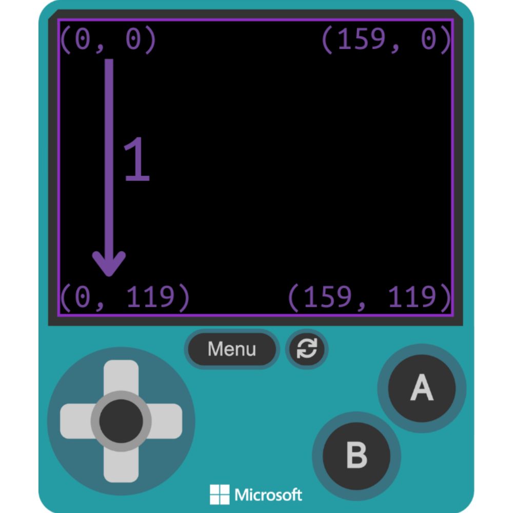

# Lesson: TODO

## Practice: Drawing a Square

### Algorithm TODO

<iframe style="position:absolute;top:0;left:0;width:100%;height:100%;" src="https://arcade.makecode.com/#pub:S11419-05415-57671-83863" frameborder="0" sandbox="allow-popups allow-forms allow-scripts allow-same-origin"></iframe>

