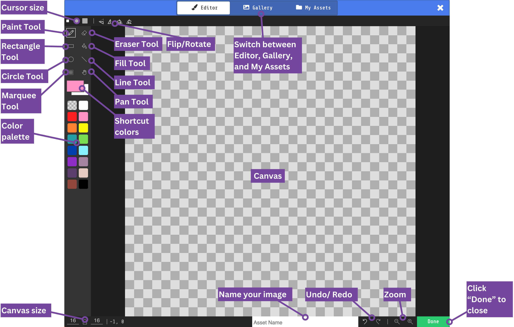

# Lesson: Creating a Character Sprite

## The Image Editor

| Label Number | Item        | Description |
| ------------ | ----------- | ----------- |
| 1            | Pencil size |             |
| 2            | Pencil      |             |
| 3            | Eraser      |             |
| 4            | Rectangle   |             |
| 5            |             |             |
| 6            |             |             |
| 7            |             |             |
| 8            |             |             |
| 9            |             |             |
| 10           |             |             |
| 11           |             |             |
| 12           |             |             |
| 13           |             |             |
| 14           |             |             |
| 15           |             |             |
| 16           |             |             |
| 17           |             |             |
| 18           |             |             |
| 19           |             |             |
| 20           |             |             |

