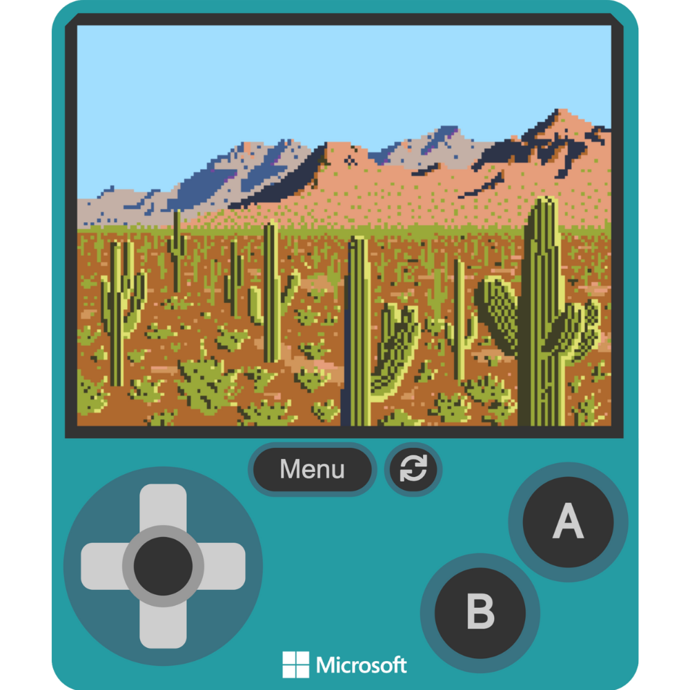

# Creating a Background

In this section, you will learn how to customize the color palette in MakeCode Arcade to reflect the unique colors of the Sonoran Desert. Using an online tool, you’ll extract colors from an image of the desert, capturing the natural tones of the environment—such as the sandy browns, vibrant greens of cacti, and soft blues of the sky. 

Once you’ve gathered the colors, you will apply them to your own custom palette in MakeCode Arcade. This will give your game design a more accurate and creative representation of the desert landscape.

