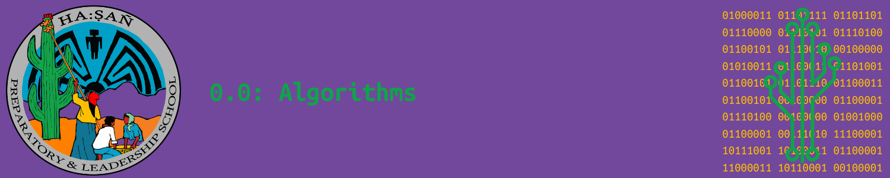

# Opener

Before we learn about algorithms, let’s think about the steps we follow in our daily activities. These steps are similar to what computers follow when running programs. For this activity, you will work individually to think about a task you do regularly that has specific steps. Then, you will share the steps of that task with the class.

## Instructions

### 1. Think of a Task

Pick a simple task that you do often, such as brushing your teeth, making a sandwich, or tying your shoes.

### 2. Write Down the Steps

On a piece of paper, list out each step needed to complete the task. Be specific, and make sure the steps are in the correct order. For example, if you’re making a sandwich, what do you need to do first, second, and so on?

### 3. Share with the Class

After writing down your steps, be ready to share them with the class. You will briefly explain your task and the order of steps you follow.