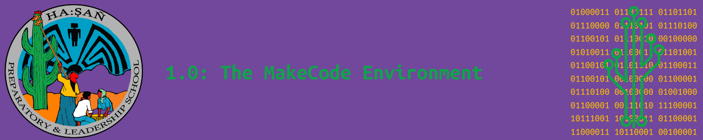

# Objectives

By the end of this section, you will be able to...

<blockquote>
  <ul style="list-style-type:circle;">
     
    <li>Understand how MakeCode Arcade is used as a tool to educate people about coding through interactive game development.</li>
    <li>Explain how MakeCode Arcade supports block-based and text-based programming, and how it helps transition learners from beginner to more advanced coding skills.</li>
    <li>Complete introductory exercises built into MakeCode Arcade to become familiar with its interface and basic coding functions.</li>
    <li>Apply fundamental programming concepts by creating simple projects in the MakeCode Arcade environment.</li>
     
  </ul>
</blockquote>

