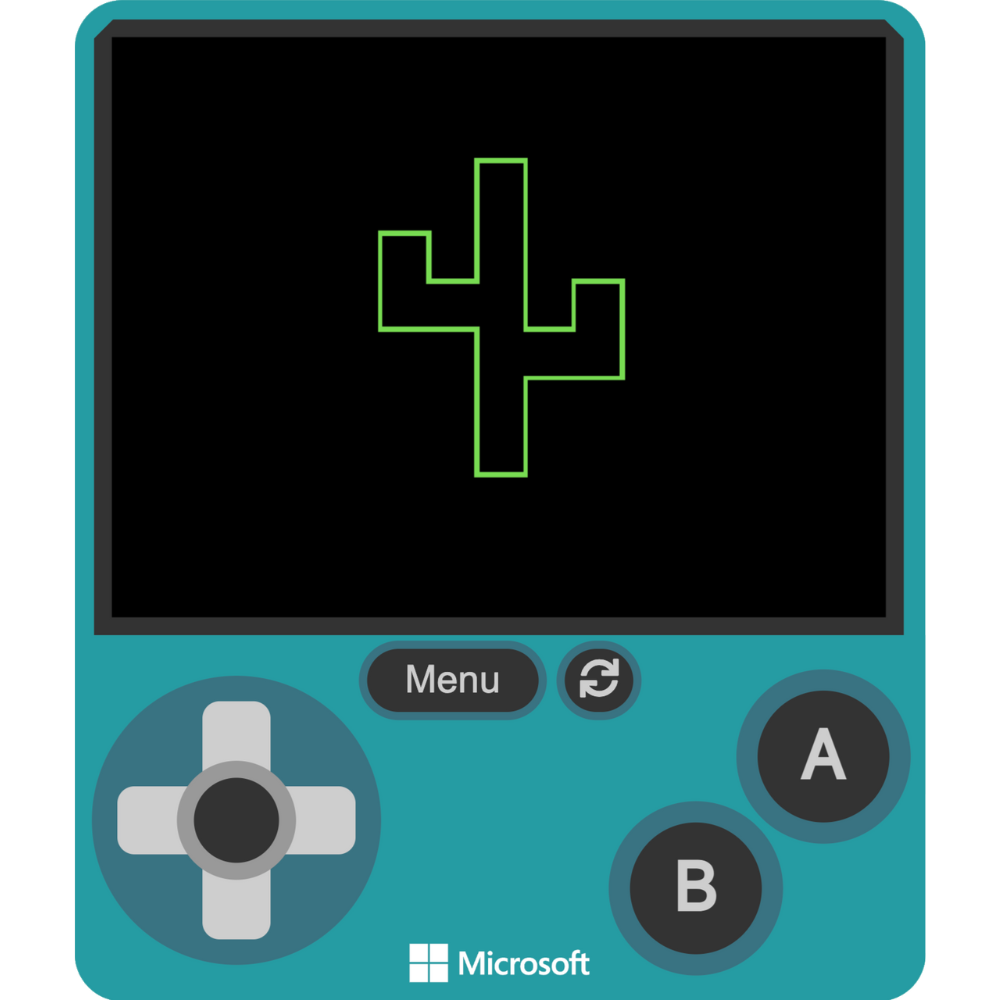

# Coordinates

In this section, we will review the Cartesian coordinate system and learn how it applies to the coordinate system in MakeCode Arcade. Understanding how coordinates work is crucial because it lets you precisely position objects and shapes in your game or project. You will use this knowledge to create a Ha:ṣañ by plotting and connecting lines using specific coordinates. By mastering both the Cartesian system and the coordinate system in MakeCode Arcade, you can create detailed and accurate designs in your games.

## What are Coordinates?

A **coordinate** is a set of values, typically written as $(x, y)$, that defines the position of a point on a grid or plane. Coordinates are widely used in various fields, such as mathematics, game development, and computer graphics, to specify where objects or elements are placed. In game development, including in MakeCode Arcade, coordinates help position characters, objects, and backgrounds on the screen, allowing for precise control of movement and placement. Using coordinates, developers can ensure that elements appear exactly where they want them in the digital environment.