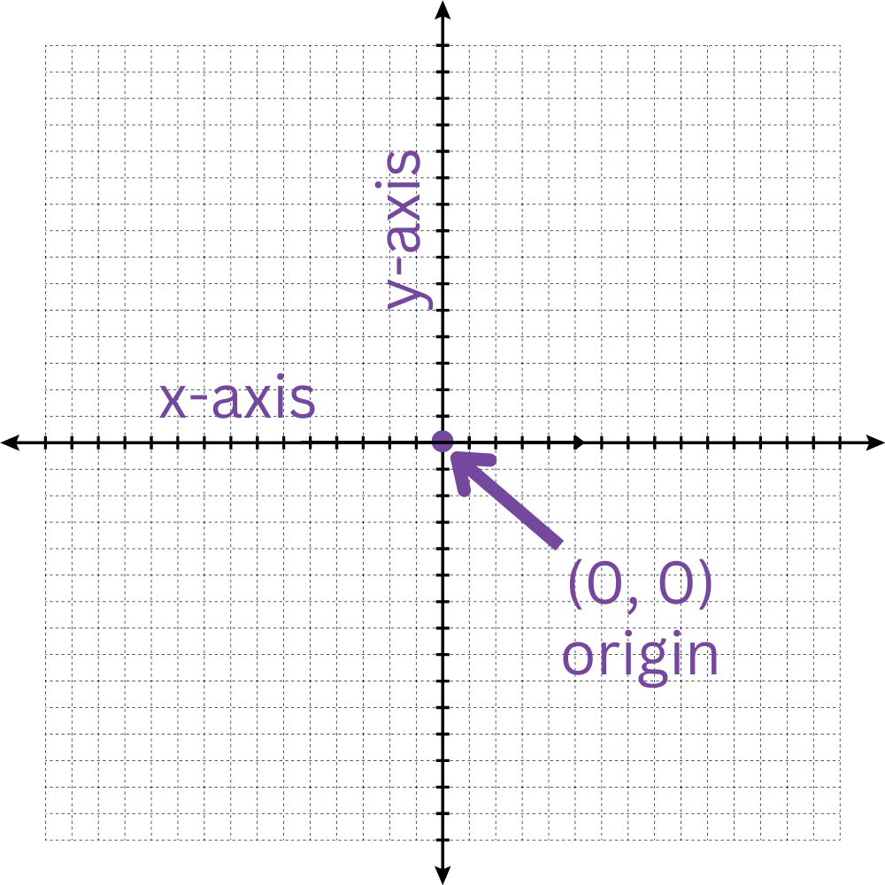
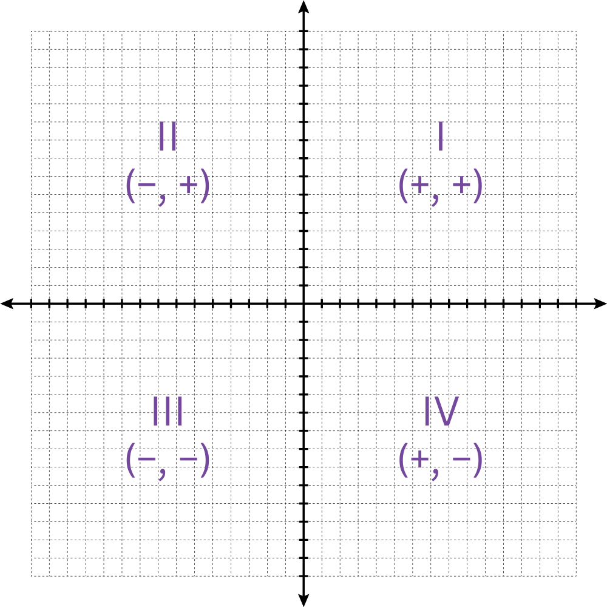

# Review: The Cartesian Plane

In mathematics, the **Cartesian plane** is a two-dimensional grid that helps us describe the position of points using coordinates. It comprises two perpendicular lines: the **x-axis** and the **y-axis**.

- x-axis: The horizontal line on the plane. It runs left to right and determines how far a point is from the center, moving sideways.
- y-axis: The vertical line on the plane. It runs up and down and helps determine how far a point is from the center, moving up or down.

Where the x-axis and y-axis meet is called the **origin**. The origin has the coordinates $(0, 0)$ and is the starting point for measuring the location of all other points on the plane.

Each point on the Cartesian plane is represented by a pair of numbers called **coordinate points**, written as $(x, y)$. The x-value tells you how far to move left or right from the origin, and the y-value tells you how far to move up or down. For example, the point $(3, 4)$ means you move three spaces to the right on the x-axis and four spaces up on the y-axis.

Using the Cartesian plane, we can precisely describe the location of any point in two-dimensional space. An image of the Cartesian plane is displayed in the figure below:

The Cartesian plane is divided into four sections, called quadrants, by the x-axis and y-axis. Each quadrant represents a different combination of positive and negative values for the coordinates:

- Quadrant I: Both x and y are positive $(+, +)$.
- Quadrant II: x is negative, and y is positive $(−, +)$.
- Quadrant III: Both x and y are negative $(−, −)$.
- Quadrant IV: x is positive, and y is negative $(+, −)$.

These quadrants are displayed in the figure below:

These quadrants help us quickly determine the signs of the coordinates for points in different parts of the plane.