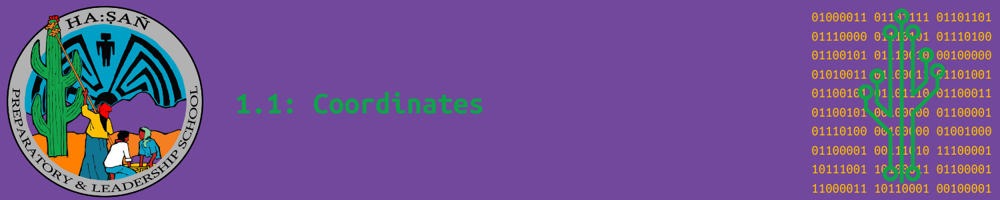

# Vocabulary

## O'odham Vocabulary

```{glossary}

ha:ṣañ
    saguaro cactus

TODO:word in O'odham for rectangle
    circle
```

## O'odham Vocabulary Audio


## Computer Science Vocabulary

```{glossary}

Cartesian plane
    a two-dimensional grid formed by the intersection of a horizontal line (x-axis) and a vertical line (y-axis), used to plot and describe the location of points using coordinate pairs (x, y).

coordinate
    

coordinate point
    a pair of numbers, written as (x, y), that represents the exact location of a point on a grid. The x-value shows the position along the horizontal axis, and the y-value shows the position along the vertical axis.

coordinate system
    a method for identifying the position of points on a grid using pairs of numbers, called coordinates. In the Cartesian plane, these coordinates are written as (x, y), where x represents the horizontal position and y represents the vertical position. In MakeCode Arcade, the coordinate system works similarly, allowing you to position objects on the game display using x and y values to define their location on the screen.

origin
    the point where the x-axis and y-axis intersect on the Cartesian plane, and it is represented by the coordinates (0, 0). It serves as the starting point for measuring the position of other points on the grid.

x-axis
    the horizontal line on the Cartesian plane, used to measure the horizontal position of points. It runs left to right and is used to determine the x-coordinate of a point.

y-axis
    the vertical line on the Cartesian plane, used to measure the vertical position of points. It runs up and down and helps determine the y-coordinate of a point.
```