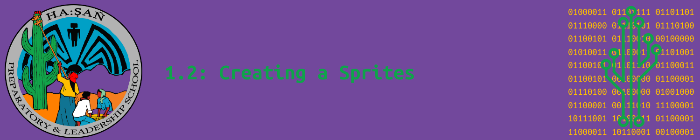

# Objectives

By the end of this section, you will be able to...

<blockquote>
  <ul style="list-style-type:circle;">
     
    <li>Use the tools in the MakeCode Arcade image editor to create a self-portrait sprite.</li>
    <li>Add a text bubble to your sprite and program it to display a phrase in the O’odham language.</li>
    <li>Understand how the size of the canvas in the image editor affects how the sprite is rendered on the screen in MakeCode Arcade.</li>
    <li>Experiment with different canvas sizes to see how they change the appearance and behavior of your sprite in the game.</li>
    <li>Apply creative design skills while learning key programming techniques for sprites in game development.</li>
     
  </ul>
</blockquote>

