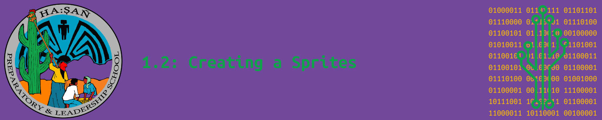

# Lesson: Using the Image Editor

The Image Editor is a simple tool similar to a painting program. It allows you to make sprties and backgrounds in MakeCode Arcade.

## The Image Editor

The figure below highlights the various parts of the Image Editor.

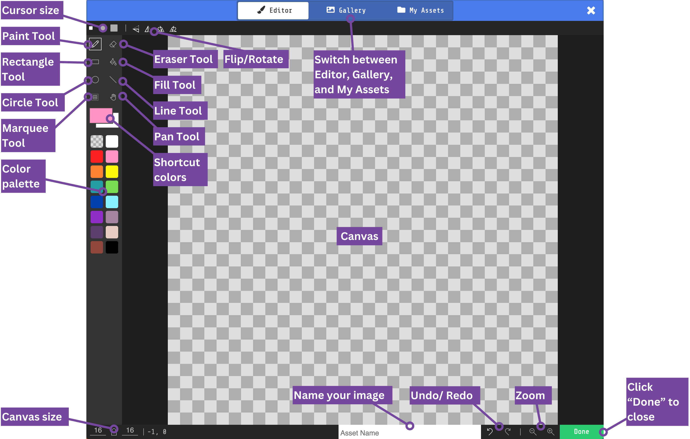

---

### The Paint Tool

The paint tool is the i

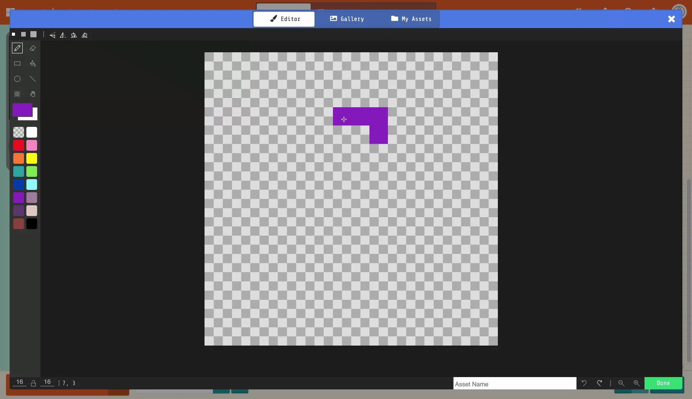

### The Eraser Tool

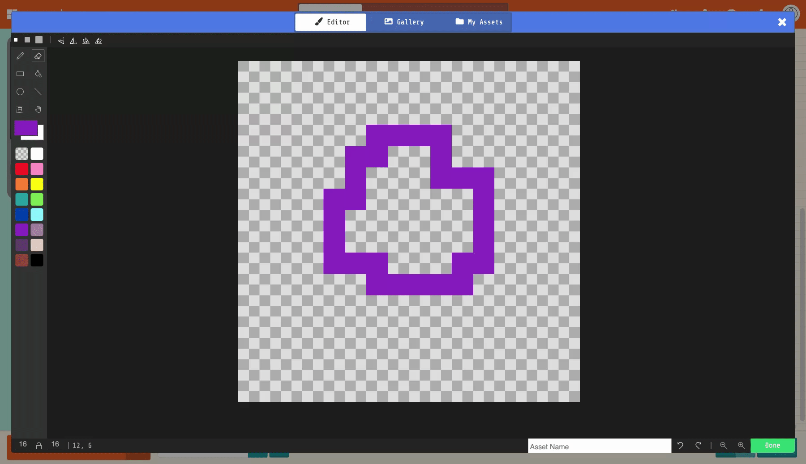

### The Rectangle Tool

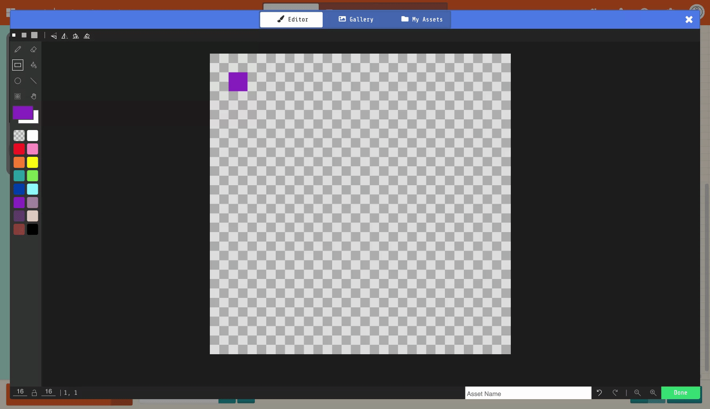

### The Fill Tool

### The Circle Tool

### The Line Tool

### The Marquee Tool

### Color Palette

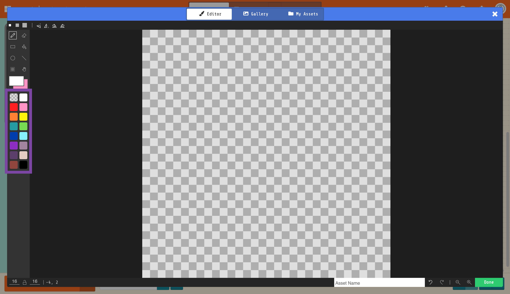

### Color Shortcuts

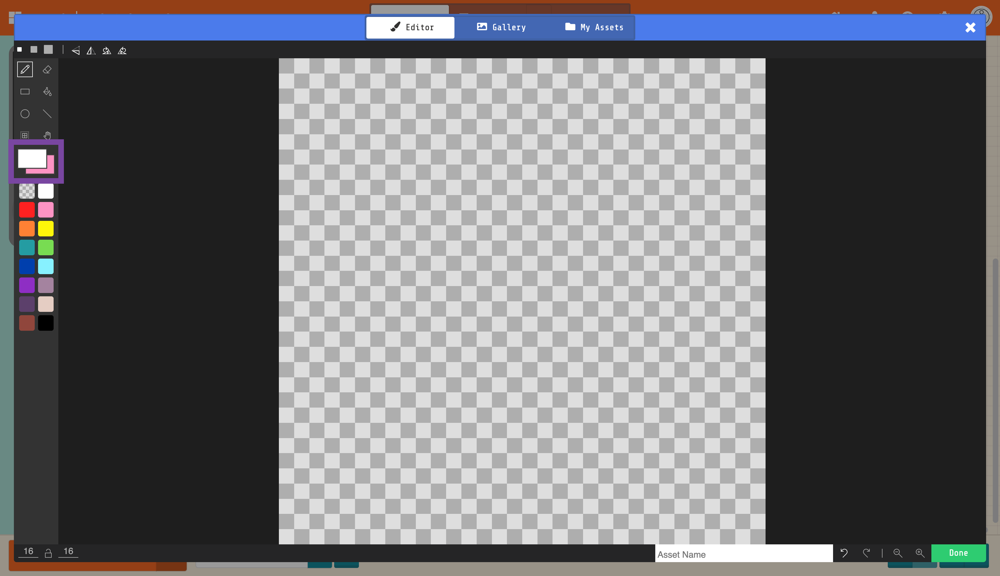

### Flip/Rotate

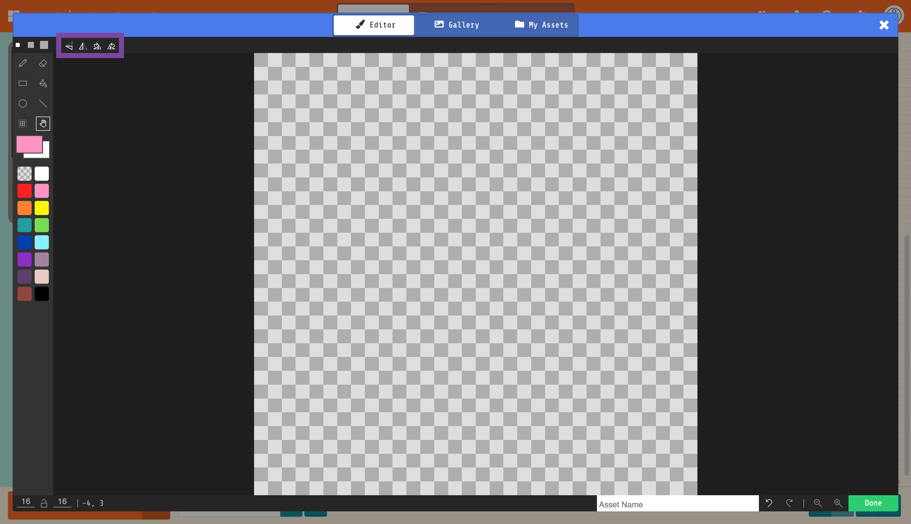

### Canvas Size

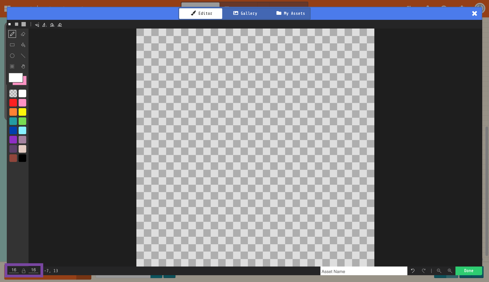

### Undo/Redo

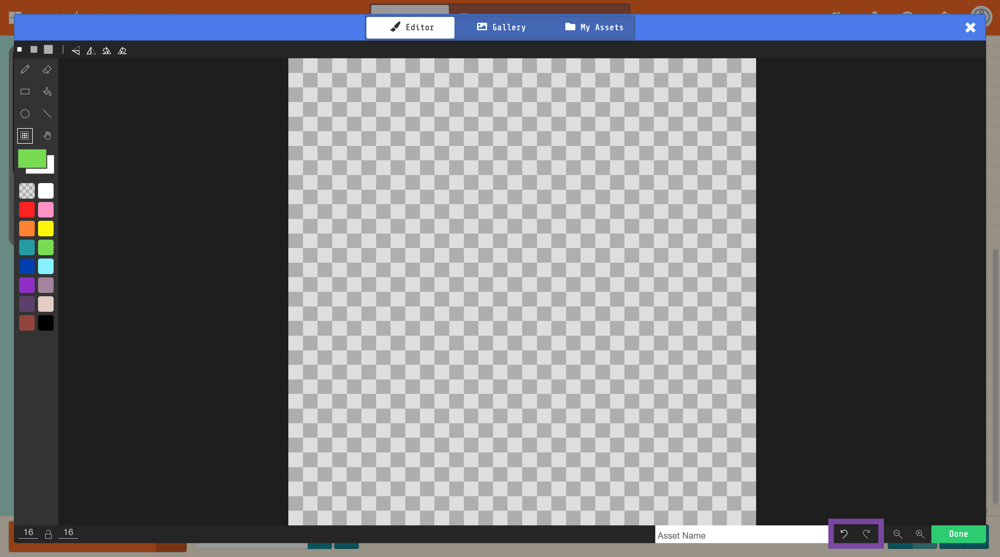

### Zoom

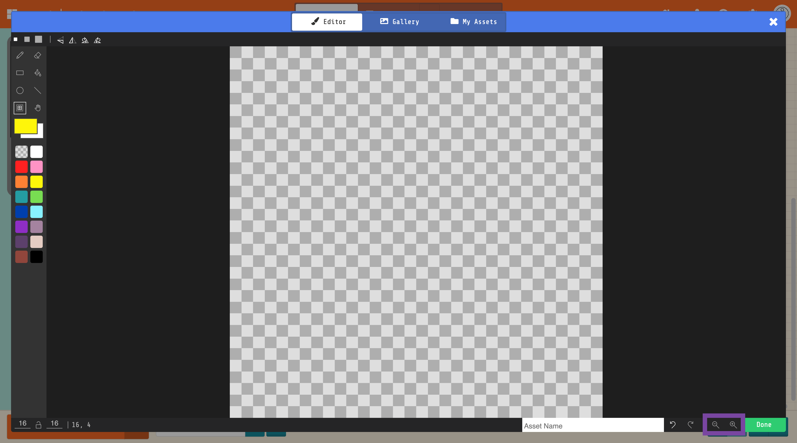

| Icon                                             | Tool        | Description |
| ------------------------------------------------ | ----------- | ----------- |
|    | Paint Tool  | TODO        |
|  | Eraser Tool | TODO        |
|                                                  |             |             |

